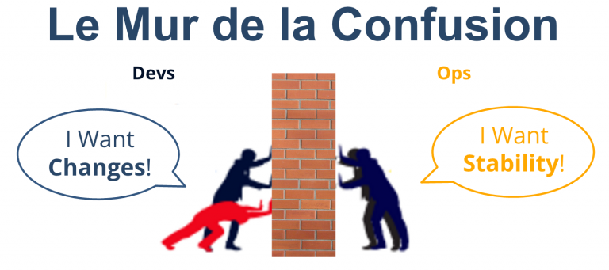
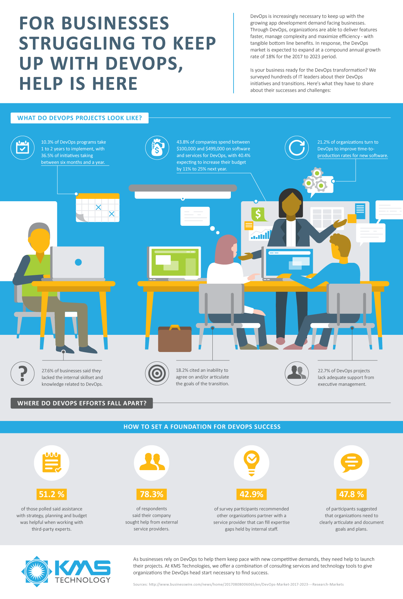
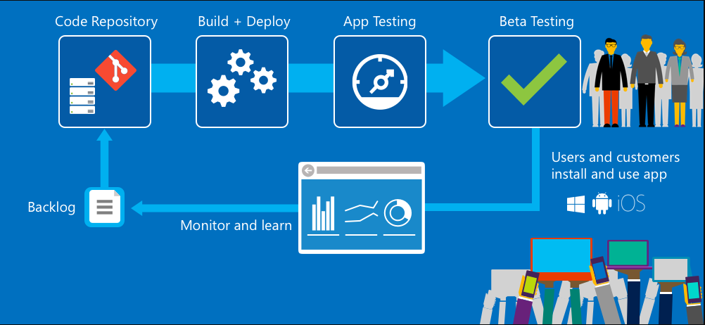

# DevOps

## Journée d'acculturation

<!-- .slide: class="title" -->
<!-- .slide: data-state="title-page"-->

---

### Michaël Fery

Coach Cloud & DevOps

---

## Agenda

- Origines
- Lego 4 DevOps (Atelier)
- Concepts
- Continuous Delivery
- Impacts & Bénéfices
- Démo / REx
- World Café (Atelier)
- Conclusion

<!-- .slide: class="title" -->
<!-- .slide: data-state="title-page"-->

---

## Introduction

<!-- .slide: data-state="chapter-page"-->

--

### Origines

#### Cousin du mouvement Agile

Agilité et DevOps, des mouvements étroitement liés

Note:
Avant de présenter le DevOps, il est essentiel d'ouvrir une petite parenthèse sur l'agilité, en effet, ces 2 mouvements sont étroitement liés...

--

### Origines

#### Les défis

- L'IT est devenu le principal vecteur de création de valeur<!-- .element: class="fragment" data-fragment-index="1" -->
- Besoin d'évolution des SI <!-- .element: class="fragment" data-fragment-index="2" -->
  - innover et s'adapter<!-- .element: class="fragment" data-fragment-index="3" -->
  - collaborer, s'adapter aux changements<!-- .element: class="fragment" data-fragment-index="4" -->

Note:
A l'ère de la transformation digitale et de l'essor des technologies numériques, l'IT est devenu le principal vecteur de création de valeur pour les entreprises.

Leurs défis consistent aujourd'hui à faire évoluer les systèmes d'informations, innover et s'adapter à tous les enjeux de mobilité, du cloud, ou encore du big data.

Les organisations se doivent d'être capables de collaborer efficacement, de s'adapter aux changements en toute confiance, tout en réalisant des innovations de manière continue, dans un contexte toujours plus concurrentiel

--

### Origines

#### Les méthodes "traditionnelles"

- Cloisonnement<!-- .element: class="fragment" data-fragment-index="1" -->
- Feedback tardifs<!-- .element: class="fragment" data-fragment-index="2" -->

Note:
Revenons sur les méthodes dites "traditionnelles". Au départ, les équipes subissaient un certain cloisonnement, ce qui peut aboutir sur des problématiques de visibilité et de suivi (qu’on appelle “effet tunnel”), ou encore des coûts et des délais mal maîtrisés…
Lorsque la part d’inconnue est la plus grande, les projets sont moins bien maîtrisés, les hypothèses de travail étant établies en amont uniquement.

Dans un tel contexte, les problèmes apparaissent alors bien tardivement, et il devient compliqué de retrouver une situation sereine.

--

### Origines

#### D'autres modes de fonctionnement

- Cycles itératifs plus courts<!-- .element: class="fragment" data-fragment-index="1" -->
  - Ajustements plus rapides et plus fréquents<!-- .element: class="fragment" data-fragment-index="2" -->
  - Fail-Fast<!-- .element: class="fragment" data-fragment-index="3" -->
- Partage des responsabilités<!-- .element: class="fragment" data-fragment-index="4" -->
- Communication essentielle<!-- .element: class="fragment" data-fragment-index="5" -->

Note:
Pour répondre à ces problématiques, le modèle agile apporte d'autres modes de fonctionnement, avec notamment des cycles itératifs plus courts.

Les ajustements deviennent alors plus rapides et plus fréquents, la notion de fail-fast introduit une gestion des erreurs au plus tôt dans le process et permet de changer de cap plus facilement et généralement à moindre coût.

Les responsabilités deviennent partagées entre les différentes parties prenantes, la communication devenant alors essentielle.

--

### Valeurs du Manifeste Agile

Note:
Pour fermer cette parenthèse sur l'agilité terminons avec les 4 valeurs définis dans le Manifeste Agile.

--

#### Valeurs du Manifeste Agile 1/4

L'attention est concentrée sur les individus et leurs interactions, plus que sur les outils et les processus.

--

#### Valeurs du Manifeste Agile 2/4

La priorité est portée sur la collaboration avec le client, et non sur la négociation contractuelle. Nous parlerons ici de co-construction

--

#### Valeurs du Manifeste Agile 3/4

Un produit qui fonctionne est préféré à une documentation exhaustive

Note: MVP

--

#### Valeurs du Manifeste Agile 4/4

L'adaptabilité et l'acceptation du changement sont favorisées, la flexibilité devenant une composante essentielle

Note:

Dans la théorie, c'est toute l'organisation qui est concernée pour appliquer ces préceptes

Dans les faits, c'est toute une population qui n'est pas systématiquement incluse dans la démarche. Les Ops sont en effet bien souvent hors du dispositif, d'où l'arrivée du mouvement DevOps

--

### Origines

#### Le DevOps

- Collaboration agile entre :<!-- .element: class="fragment" data-fragment-index="1" -->
  - Les études et le développement<!-- .element: class="fragment" data-fragment-index="2" -->
  - La production<!-- .element: class="fragment" data-fragment-index="3" -->
  - L'exploitation et l'infrastructure<!-- .element: class="fragment" data-fragment-index="4" -->
  - Les métiers.<!-- .element: class="fragment" data-fragment-index="5" -->

=> Optimiser la phase de livraison d'un produit ou d'un service, en conservant un niveau élevé de confiance et qualité
<!-- .element: class="fragment" data-fragment-index="6" -->

Note:
Nous pouvons alors définir le mouvement DevOps comme une démarche de collaboration agile entre plusieurs intervenants :

- Les études et le développement
- La production
- L'exploitation et l'infrastructure
- Les métiers.

Il permettra à une entreprise d'optimiser la phase de livraison d'un produit ou d'un service, en conservant un niveau élevé de confiance et de qualité.

Le DevOps, cousin du mouvement agile peut être vu comme une extension de ce dernier, ses valeurs pouvant être appliquées à toute la chaîne de valeur du produit.

---

## Lego 4 DevOps (Atelier)

<!-- .slide: data-state="chapter-page" -->

---

## Origines...

Note:
Débriefer sur l'atelier lego sur DevOps

--

### Ce que veulent les Dev

- Le développement de nouvelles fonctionnalités<!-- .element: class="fragment fade-in" data-fragment-index="1" -->
- La qualité (non-régression, nombre de <!-- .element: class="fragment fade-in" data-fragment-index="2" -->_bugs_<!-- .element: class="fragment fade-in" data-fragment-index="2" --> réduit)<!-- .element: class="fragment fade-in" data-fragment-index="2" -->
- La rapidité de mise à disposition aux utilisateurs finaux<!-- .element: class="fragment fade-in" data-fragment-index="3" -->
- Le<!-- .element: class="fragment fade-in" data-fragment-index="4" --> _feedback_<!-- .element: class="fragment fade-in" data-fragment-index="4" -->

Culture du **produit** en y apportant du **changement**

<!-- .element: class="fragment fade-in" data-fragment-index="5" -->

--

### Ce que veulent les Ops

- La stabilité et la robustesse<!-- .element: class="fragment fade-in" data-fragment-index="1" -->
- La maîtrise<!-- .element: class="fragment fade-in" data-fragment-index="2" -->
- La performance et la sécurité<!-- .element: class="fragment fade-in" data-fragment-index="3" -->
- Les possibilités d'industrialisation avec une certaine efficience économique<!-- .element: class="fragment fade-in" data-fragment-index="4" -->

Culture du **service** en y apportant de la **stabilité**

<!-- .element: class="fragment fade-in" data-fragment-index="5" -->

--

### Le mur de la confusion

Note:
Chaque équipe se reconnaît et défend la légitimité de ses propres objectifs.
Ils n'ont pas tort, et c'est la qu'il y a confusion : Ces objectifs sont des objectifs intermédiaires et non exclusifs.
C'est ce qu'on appelle le mur de la confusion.

--

### Les causes de la confusion

- Objectifs non alignés
- Organisation en silo de ces deux équipes
- Les équipes n'évoluent pas dans les mêmes échelles de temps
- Language et outils différents
- Méconnaissance des contraintes

---

## Concepts

DevOps **n’est pas** une **méthode**

<!-- .element: class="fragment" data-fragment-index="1" -->

C'est une **culture**

<!-- .element: class="fragment" data-fragment-index="2" -->

Note:
Le DevOps est né. On le définit ?

Ce que n'est pas le DevOps

DevOps est une Culture

Stop opposition Dev vs Ops

<!-- .slide: data-state="chapter-page" -->

--

### Définition

> DevOps is the union of people, process, and products to enable continuous delivery of value to our end users.
>
> -- _Donovan Brown_

<!-- .element: class="fragment" data-fragment-index="1" -->

Note:
Donovan Brown, responsable DevOps chez Microsoft

Slide la plus importante !

Lire Definition

Qui ? Pourquoi ? Comment ?

Agile++

--

### Principe Agile

> Notre plus haute priorité est de satisfaire le client en livrant rapidement et régulièrement des fonctionnalités à grande valeur ajoutée.
>
> -- _1er principe du « Manifeste agile »_

[agilemanifesto.org](https://agilemanifesto.org)

Note:
Introduire Manifeste Agile - Février 2001 naissance du manifeste agile

Lire Définition

Parallèle : Continuous Delivery

Et mes objectifs ?

--

### Besoin

Apporter de la valeur aux utilisateurs finaux plus rapidement et de manière plus sécurisante :

- Réduire le **_Time to Market_**
- **Accélérer la boucle de _feedback_**
- **Accélérer les livraisons** en allégeant les processus
- **Garder/augmenter la fiabilité** pour minimiser l'erreur humaine
- **Amélioration continue**

Note:
Ramener à la réalité

Time-To-Market : livrer vite les nouveautés et fix

Utilisateur final : qualité feedback

Accélération VS Qualité ? Non!

Amélioration continue

--

### Facteur Humain

- Donner le temps
- Partage de responsabilité
- Echange, collaboration
- Confiance

Note:
Il faut du temps pour évangeliser, accompagner et assimiler

Communication sur les responsabilités de chacun. Attention un Dev != Admin Sys

Améliorer et augmenter les échanges, comme de la co-localisation ou des outils

Partage des informations et des contraintes entre Dev et Ops

collaboration des équipes plutôt que le protectionnisme

Un objectif commun et partagé afin d'instaurer une confiance entre les équipes

--

### Processus

- Plus d'échanges au plus tôt afin de connaitre les besoins et les contraintes des équipes
- Première boucle de _feedback_

--

### Outils

- Outils de communication (tickets, discussion, _meetings_, ...)
- Methodes communes
- Partager des livrables communs et acceptés de tous (qu'il soient documentaires ou binaires)
- Automatisation
- Chaîne d’intégration et de livraison continue

---

### CALMS

- _**C**ulture_
- _**A**utomation_
- _**L**ean_
- _**M**easurement_
- _**S**haring_

Note:
"Lean" => Amélioration continue

---

## DevOps is / DevOps is not

<!-- .slide: data-state="chapter-page"-->

--

### DevOps
### is <!-- .element: class="fragment" data-fragment-index="1" --> _not_ <!-- .element: class="fragment" data-fragment-index="1" -->

> Un rôle

Note:
Contrairement à une erreur répandue, le DevOps n'est pas un rôle. Comme nous le définissons toute la journée, il s'agit d'un mouvement englobant les Devs et les Ops.

--

### DevOps
### is <!-- .element: class="fragment" data-fragment-index="1" --> _not_ <!-- .element: class="fragment" data-fragment-index="1" -->

> Une nouvelle équipe

Note:
Comme DevOps n'est pas un rôle, il ne peux pas non plus être une équipe. Le but de cette démarche est de rapprocher et d'améliorer la communication entre les Dev et les Ops. Rajouter une équipe entre les deux serait donc aller à l'encontre de cela.

--

### DevOps
### is <!-- .element: class="fragment" data-fragment-index="1" --> _not_ <!-- .element: class="fragment" data-fragment-index="1" -->

> Faire coder les Ops & administrer des machines aux Dev

Note:
Le DevOps n'implique pas la polyvalence de tous les acteurs. La coopération étroite ne doit pas donner lieu à une inversion des rôles. C'est au contraire une façon de reconnaître les forces et les faiblesses de chacun et d'en tirer le meilleur, collectivement.

--

### DevOps
### is <!-- .element: class="fragment" data-fragment-index="1" -->

> Les Ops sont des facilitateurs, non des limiteurs

Note:
Dans les domaines dont il est le garant, l’OPS doit être facilitateur (par son savoir-faire) et non-pas censeur.

--

### DevOps
### is <!-- .element: class="fragment" data-fragment-index="1" --> _not_ <!-- .element: class="fragment" data-fragment-index="1" -->

> no-Ops

Note:
L'automatisation est un vecteur d'autonomisation des acteurs et d'amélioration des opérations. Le DevOps ne doit en aucun cas être compris comme un moyen de se décharger de sa responsabilité.

--

### DevOps
### is <!-- .element: class="fragment" data-fragment-index="1" --> _not_ <!-- .element: class="fragment" data-fragment-index="1" -->

> Les Devs ont tous les droits

Note:
Le DevOps est un mouvement favorisant la coopération, pas le remplacement des Ops par des Dev.
Il arrive que certains Dev aient besoin de privilèges, comme des droits d'accès par exemple. Mais par nature même, le DevOps doit minimiser ce besoin.
L'idée n'est pas d'autoriser tous les Dev à accéder aux ressources critiques, et pour cela il est nécessaire de bien cadrer le besoin.

--

### DevOps
### is <!-- .element: class="fragment" data-fragment-index="1" -->

> Se concentrer sur une réalisation minimale apportant un maximum de valeur

Note:
Toute réalisation doit être itérative, pour accélérer l'arrivée de la boucle de feedback. En ce sens, on doit chercher le plus petit élément de réalisation qui apporte le maximum de valeur.

--

### DevOps
### is <!-- .element: class="fragment" data-fragment-index="1" -->

> Réduire la documentation à sa plus juste utilité

Note:
Elle peut même être remplacée par le partage des outils, des méthodes, du même espace de travail et les rituels de partage de connaissance (stand up meeting, peer-programming, démo).

--

### DevOps
### is <!-- .element: class="fragment" data-fragment-index="1" -->

> You build it, you run it
>
> -- _Werner Vogels_

Note:
Les Dev et les Ops sont (co-)responsable de ce qui arrive en Prod (y compris dans les astreintes).

--

### DevOps
### is <!-- .element: class="fragment" data-fragment-index="1" -->

> Tolérant aux pannes

Note:
Les Pannes et les erreurs humaines sont inévitables. Par design, on doit les circonscrire et mettre en place les contre-mesures qui rendent ces pannes indolores.

--

### DevOps
### is <!-- .element: class="fragment" data-fragment-index="1" --> _not_ <!-- .element: class="fragment" data-fragment-index="1" -->

> Un outil permettant de tout gérer

Note:
Le partage d'outils doit répondre à un besoin de coopération et d'autonomie et pas seulement au besoin d'industrialisation ou de respect des standards.
L'usage d'un outil fréquemment utilisé dans les organisations DevOps n'est ni nécessaire ni suffisant pour faire du DevOps, mais vous vous apercevrez que sans c'est quand même bien plus compliqué.

--

### DevOps
### is <!-- .element: class="fragment" data-fragment-index="1" -->

> Testabilité

Note:
Toute réalisation n'est achevée que lorsque le test garantissant la conformité de son fonctionnement est associé.

--

### DevOps
### is <!-- .element: class="fragment" data-fragment-index="1" -->

> Centré sur le produit utilisateur

Note:
La qualité et la pertinence du produit fourni à l'utilisateur final est la seule chose qui importe.

--

### DevOps
### is <!-- .element: class="fragment" data-fragment-index="1" -->

> Measure Anything, Measure Everything
>
> -- _Etsy (2011)_

Note:
L’obsession de la mesure et de la traçabilité. Ce qui ne se mesure pas n’est qu’affaire d’opinion.

--

### DevOps
### is <!-- .element: class="fragment" data-fragment-index="1" -->

> Plan, do, check, act (PDCA)

Note:
L'amélioration continue : cette démarche est basée sur l'expérimentation perpétuelle et la mesure du résultat qui en ressort.

--

### DevOps
### is <!-- .element: class="fragment" data-fragment-index="1" -->

> Refus de l'_over-engineering_

Note:
Il s’agit de garder un certain pragmatisme dans les fonctionnalités réalisées. Ne pas développer un tableau de bord d’Airbus quand une calculette suffit. Prenons l’exemple du principe de KISS (Keep it simple, stupid, Keep it Smart & Simple)

--

### DevOps

### is <!-- .element: class="fragment" data-fragment-index="1" --> _not_ <!-- .element: class="fragment" data-fragment-index="1" -->

> Magique !

Malheureusement... <!-- .element: class="fragment" data-fragment-index="2" -->

---

## Continuous Delivery

<!-- .slide: data-state="chapter-page"-->

Note:
Rappel DevOps: union des gens, des process et des outils pour délivrer RAPIDEMENT de la valeur aux utilisateurs finaux.
Un processus de livraison continu implique de pouvoir livrer à tout moment, avec une qualité élevée. Cela contraste avec ce que l'on peut voir en général.

--

## Continuous Delivery: Pourquoi ?

On peut publier le correctif ?

<!-- .element: class="fragment" data-fragment-index="1" -->

- NON! Fred est en vacances et c'est lui qui a les droits<!-- .element: class="fragment" data-fragment-index="2" -->
- NON! Nous n’avons pas terminé le cycle complet d’assurance qualité<!-- .element: class="fragment" data-fragment-index="3" -->
- NON! Le processus de publication n'est pas clair<!-- .element: class="fragment" data-fragment-index="4" -->

Note:
Prenons l'exemple d'une application mobile.
NON! Fred est en vacances et il est le seul membre de l’équipe à pouvoir créer, signer pour distribution et déposer sur le store.
NON! Nous n’avons pas terminé le cycle complet d’assurance qualité de la branche principale actuelle et il faudra trois jours pour effectuer les tests de régression manuels. En passant, qui a un iPhone 4S sous iOS 9.2 pour faire un test?
NON! Nous ne savons pas exactement combien de temps le processus de publication prend; la validation peut prendre entre 5 et 12 jours.
Cela vous semble familier?

--

## Continuous Delivery: Et chez vous ?

- À quelle fréquence publiez-vous des mises à jour?<!-- .element: class="fragment" data-fragment-index="1" -->
  - Quelques fois par an? Trimestriel? Mensuel, bi-hebdomadaire? Tous les jours? Plusieurs fois par jour?<!-- .element: class="fragment" data-fragment-index="2" -->
- C'est absurbe, non ?<!-- .element: class="fragment" data-fragment-index="3" -->
- Vraiment ?!<!-- .element: class="fragment" data-fragment-index="4" -->

Note:
Pensez à l'une de vos applications. À quelle fréquence publiez-vous des mises à jour? Quelques fois par an? Trimestriel? Mensuel, bi-hebdomadaire? Tous les jours? Plusieurs fois par jour? Non! C'est absurde, non?
Est-ce vraiment absurde ?
Certaines équipes techniques d’applications de niveau mondial sont en mesure de livrer leurs applications de manière régulière toutes les semaines ou toutes les deux semaines avec une qualité élevée. Comment parviennent-elles à faire cela? Une partie de l'explication est l'engagement dans un processus de livraison continu sous une forme ou une autre. Examinons quelques-uns des challenges et des bénéfices du DevOps et, plus important encore, pourquoi cela est accessible à tous. Vous n'avez pas besoin d'être une start-up soutenue par une entreprise ou une énorme entreprise pour commencer!

---

## Impacts

<!-- .slide: data-state="chapter-page"-->

Note:
Le DevOps arrive seconde vague de l'émergence de l'agilité au sein des équipes projets, du cloud et des outils type conteneurs.
Le déclencheur est donc le suivant : un choc de productivité et d’agilité.
Les DSI sont-elles prêtes à s'adapter à ce nouvel écosystème ?
On notera que, plus que la DSI elle-même, dans son rôle global, ce sont ses structures internes - directions de l’ingénierie, de l’infrastructure informatique et de la production informatique - qui sont secouées par ces évolutions.

--

### Impacts organisationnels

- Collaboration
- Automatisation
  - Automatisation du déploiement
  - Intégration continue
  - Automatisation de l'infrastructure
- Outils
- Plateformes

Note:
La collaboration doit être inscripte dans les process de gestion de projets (intégration des Ops et Sec tout au long du cycle de vie projet)
Besoin d'outils de gestions de tickets, de code source, d'automatisation de test et de livraison
Besoin de plateformes adaptées (Cloud, Conteneurs, ...) pour faciliter l'automatisation

--

### Impacts humains

- Faire accepter le changement
- Culture du partage

Note:
Chaque acteur du projet garde sa compétence et son expertise mais doit partager ses contraintes et collaborer au maximum

--

### Impacts business

- _Money, money, money_
  - _Quality isn't cheap_
- Une transition lente (à l'echelle de l'IT)
  - 85% des migrations/adoptions DevOps prennent un an
- Une décision à bien mûrir

Note:
Les transitions organisationnelles ne sont pas connues pour être rapides, la mise en place de l'agilité au préalable peut aider

--

---

## Bénéfices

<!-- .slide: data-state="chapter-page"-->

--

### Bénéfices organisationnels

- Résolution des points de contention
- Performance
  - Nombre de déploiements de code
  - Délai de bascule du commit au déploiement
  - Taux d'échec
  - Stabilité des systèmes
- Amélioration continue
  - Automatisation de la validation des changements
  - Visualisation des métriques de productivité et de qualité
- Flexibilité et agilité

Note:
Les entreprises recourent au DevOps pour résoudre les points de contentions. Ces derniers varient en fonction de la responsabilité des équipes IT, chacun voyant un intérêt particulier à installer une approche DevOps.

- Rapidité et sécurisation de livraison de valeur
  - Accélération des livraisons et déploiements
  - Sécurisation des livraisons et déploiements
- Les pratiques d’amélioration continue (lean) sont des optimisations une fois mis en place les éléments précédents.

--

### Bénéfices humains

- Efficacité
- Estime de soi
- Confiance
- Engagement
- Collaboration
- Montée en compétence (cross-skilling)
- Respect du top-management

Note: Globalement il s'agit du moral des équipes
Mieux les équipes communiquent, mieux elles travaillent ensemble
Et plus elles travaillent ensemble, plus elles sont heureuses.

--

### Bénéfices business

- _Time-to-market_
- Expérience client
- Résolution de problèmes
- Temps pour l'innovation

Note:
Time-To-Market

- Amélioration du temps nécessaire à la livraison de résultats
- C'est probablement le bénéfice que les utilisateurs ou PO comprennent le mieux
  Customer experience
- 70% des DSI remontent une amélioration de l'XP utilisateur après la mise en place du DevOps
  Résolution de problèmes
- Plus un problème est long à résoudre, plus la société perd d'argent
  Innovation
- plus les process sont rodées et efficaces, plus vos équipes auront de temps dégagé pour brainstormer et déveloper de nouvelles idées, et plus l'expérimentation sera aisée et rapide

---

## Démo / REx

<!-- .slide: data-state="chapter-page"-->

--

---

## World Café (Atelier)

<!-- .slide: data-state="chapter-page"-->

---

## Conclusion

<!-- .slide: data-state="chapter-page"-->
